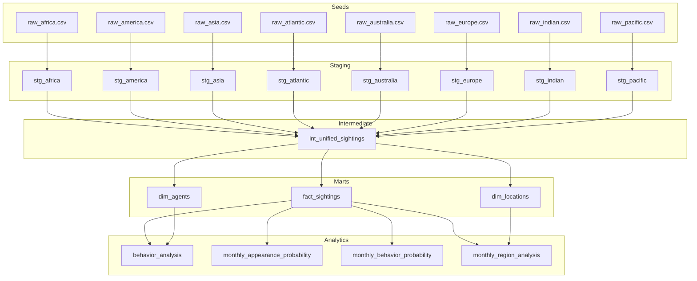

# Carmen Sandiego Sightings DBT & ML Project

## Table of Contents
- [Project Overview](#project-overview)
- [Structure](#structure)
- [Repository Files](#repository-files)
- [Installation & Setup Guide](#installation--setup-guide)
- [Pipeline flow, Decisions, & Schema Design](#pipeline-flow-decisions--schema-design)
- [Entity Relationship Diagram](#entity-relationship-diagram)
- [Analytics](#analytics)
- [Machine Learning Methods & Insights](#machine-learning-methods--insights)

## Project Overview

This dbt project transforms Carmen Sandiego sighting data from 8 different regional sources into a unified analytical schema. The project follows an ELT (Extract, Load, Transform) pattern using dbt with PostgreSQL as the data warehouse. Finally this project also features a bonus machine learning step to showcase its use. 

---

### Structure



### Repository Files

```
cascade_carmen_dbt_project/
├── README.md                  # Project documentation
├── dbt_project.yml            # dbt project config
├── extract.py                 # Extracts Excel to CSV seeds
├── data/
│   └── raw/                   # Original Excel data
├── seeds/                     # 8 regional raw CSVs (input to dbt)
├── models/
│   ├── staging/               # Standardizes each region (stg_*.sql)
│   ├── intermediate/          # Combines all regions (int_unified_sightings.sql)
│   ├── marts/                 # Core tables: fact & dimensions, plus analytics
│   └── schema.yml             # Data tests (unique, not_null, etc)
├── macros/                    # Reusable SQL logic (e.g., standardize_columns)
└── tests/                     # (Optional) Custom test SQL
```

### Installation & Setup Guide

- clone this repo and run 'pip install -r requirements.txt' for dependencies.
- run 'python extract.py' to extract Excel data sheets into individual csv files.
- Setup postgreSQL database & local PostgreSQL credentials.
- initialize dbt project (dbt init project_name), & configure ~/.dbt/profiles.yml.
- ensure dbt_projects.yml is properly configured.
- Finally use simple dbt commands to run the entire pipeline (line-by-line):

    ```bash
    dbt debug   # to test connection with database
    dbt deps    # to install dbt_packages if needed
    dbt seed    # Load seeds data into postgreSQL database as initial raw tables
    dbt run     # Build all models
    dbt test    # Run data quality tests
    dbt compile # Generates executable SQL from source, model, test, and analysis files
    dbt docs generate && dbt docs serve  # Generate and view dbt docs via localhost:8080
    ```

- For analytics, navigate to postgreSQL database through psql shell (or first run 'psql -U postgres -d your_database' for access from any terminal) to run SQL quries.

    ```bash
    # Ex:
    psql -U <username> -d <database_name>   # only for using in dif terminal that is not psql
    \dn                                 # -- Check schemas
    \dt carmen_marts.*                   # -- Check tables in marts schema
    SELECT * FROM carmen_marts.fact_sightings LIMIT 5;      # -- Sample data
    ```

- Finally run bonus **machine learning** step for addition data insights.
    
    ```bash
    python ml_analysis.py 
    ```

### Pipeline flow, Decisions,& Schema Design 

- **Staging/Intermediate/Marts Layers**: The dbt project uses a layered approach:
  - **seeds**: raw data extracted from excel and ingested into postgres database
  - **Staging**: Each region’s raw data is standardized into a common schema using macros.
        - view models for mapping columns names to each source
  - **Intermediate**: All standardized data is joined into a single unified view.
        - Boolean standardization across regions
        - view model for mapping columns for column name with 
  - **Marts/Core**: Fact and dimension tables are built from the unified data, with surrogate keys and  datacleaning.
- **Star schema**: Fact table is in the 3rd normal form while dimension tables are denormalized for query performance and ease of analysis. This reduces the need for complex joins and accelerates dashboarding and machine learning workflows.
    - Surrogate key generation used for uniqueness and referential integrity
- **Analytics**: Specialized models answer business questions and provide metrics for reporting and machine learning.
- **Testing & Validation**: dbt tests and schema.yml files are used to validate data integrity (e.g., uniqueness, null checks, referential integrity). More data integrityy. Ex:
        - Column type assertions for dates and coordinates
        - Null checks for critical fields

### Entity Relationship Diagram


<!-- ```mermaid
erDiagram
    dim_agents {
        string agent_id PK
        string agent
        string agent_hq_city
        string region
    }
    dim_locations {
        string location_id PK
        string city
        string country
        float latitude
        float longitude
        string region
    }
    fact_sightings {
        string sighting_id PK
        date date_witness
        date date_agent
        string witness
        string agent
        string city
        string country
        string city_agent
        float latitude
        float longitude
        boolean has_weapon
        boolean has_hat
        boolean has_jacket
        string behavior
        string region
    }
    dim_agents ||--o{ fact_sightings : has_agent
    dim_locations ||--o{ fact_sightings : has_location
```

--- -->


<!-- ## **Star Schema Structure**
---
### **Normalization & Standardization**

- **Standardization:**  
  - All raw data is mapped to a consistent schema in the staging layer using the `standardize_columns` macro. This ensures that, regardless of the source, columns like `agent`, `city`, `has_weapon`, etc., have the same names and types.
- **Normalization:**  
  - The star schema is a blend of normalized and denormalized design:
    - **Dimension tables** are normalized to the 3rd normal form to reduce redundancy in maintain data quality. Each agent/location appears only once, with a unique surrogate key ensuring referential integrity.
    - **Fact table** is denormalized to enable fast, simple queries for analytics and reporting purposes. It stores foreign keys to dimensions and all event attributes for fast querying, as all relevant data is one join away. -->

---

# Analytics

---
Four Key Questions:
A. **Regional Monthly Activity**: Which region has the most sightings per month
B. **Appearance Probability**: Likelihood of specific clothing combo (armed + jacket - hat)
C. **Top Behaviors**: Top 3 frequently observed behaviors
D. **Behavior Probability**: Monthly probability exhibiting of top behaviors

### A. Monthly region analysis

The table shows sightings by month (with 1 meaning January). It also shows how often Carmen Sandiego was seen. The graph highlights that she’s mostly spotted in Kolkata and New York.

| month_n | city_agent | record_count |
|---------|------------|--------------|
| 1       | Kolkata    | 98           |
| 2       | New York   | 86           |
| 3       | New York   | 89           |
| 4       | New York   | 91           |
| 5       | Kolkata    | 94           |
| 6       | Kolkata    | 83           |
| 7       | New York   | 94           |
| 8       | Kolkata    | 88           |
| 9       | New York   | 71           |
| 10      | New York   | 69           |
| 11      | New York   | 93           |
| 12      | Kolkata    | 94           |

### B. Appearance probability

The probability of Carmen being armed and wearing a jacket but not a hat is highest in June (4.74%) and lowest in November (2.43%). This appearance is rare overall, never exceeding 5% in any month. She is almost always seen with a jacket, and often with a hat, but being armed is less common.

| month_n | total_per_month | conditional_per_month | probability | armed_count | hat_count | jacket_count | armed_probability | hat_probability | jacket_probability |
|---------|-----------------|----------------------|-------------|-------------|-----------|--------------|-------------------|-----------------|--------------------|
| 1       | 1147            | 44                   | 0.0384      | 125         | 716       | 1074         | 0.1090            | 0.6242          | 0.9364             |
| 2       | 1045            | 35                   | 0.0335      | 122         | 675       | 969          | 0.1167            | 0.6459          | 0.9273             |
| 3       | 1147            | 53                   | 0.0462      | 135         | 723       | 1061         | 0.1177            | 0.6303          | 0.9250             |
| 4       | 1118            | 36                   | 0.0322      | 124         | 706       | 1032         | 0.1109            | 0.6315          | 0.9231             |
| 5       | 1178            | 41                   | 0.0348      | 117         | 740       | 1096         | 0.0993            | 0.6282          | 0.9304             |
| 6       | 1139            | 54                   | 0.0474      | 153         | 731       | 1041         | 0.1343            | 0.6418          | 0.9140             |
| 7       | 1147            | 44                   | 0.0384      | 122         | 710       | 1055         | 0.1064            | 0.6190          | 0.9198             |
| 8       | 1147            | 50                   | 0.0436      | 138         | 726       | 1055         | 0.1203            | 0.6330          | 0.9198             |
| 9       | 1110            | 48                   | 0.0432      | 134         | 697       | 1022         | 0.1207            | 0.6279          | 0.9207             |
| 10      | 1147            | 49                   | 0.0427      | 124         | 693       | 1047         | 0.1081            | 0.6042          | 0.9128             |
| 11      | 1110            | 27                   | 0.0243      | 117         | 692       | 1029         | 0.1054            | 0.6234          | 0.9270             |
| 12      | 1147            | 52                   | 0.0453      | 141         | 717       | 1078         | 0.1229            | 0.6251          | 0.9398             |

### C. Behavior analysis

Based on your results, the three most common behaviors observed for Carmen Sandiego are out-of-control, complaining, and happy. However, lack of variability across all behaviors suggests that Carmen exhibits a diverse range of behaviors.

| behavior        | frequency | percentage | behavior_rank |
|-----------------|-----------|------------|---------------|
| out-of-control  | 637       | 4.69       | 1             |
| complaining     | 636       | 4.68       | 2             |
| happy           | 635       | 4.68       | 3             |


### D. Monthly behavior probability

For each month, the probability that Carmen exhibits one of her three most common behaviors ranges from about 12% to 15%. The highest probability occurs in May (15.28%), while the lowest is in October (12.12%). With only minor variation throughout the year this once again suggests her behavioral patterns are relatively consistent across all months.

| month_n | total_per_month | top_behavior_count | top_behavior_probability |
|---------|-----------------|-------------------|-------------------------|
| 1       | 1147            | 160               | 0.1395                  |
| 2       | 1045            | 144               | 0.1378                  |
| 3       | 1147            | 171               | 0.1491                  |
| 4       | 1118            | 154               | 0.1377                  |
| 5       | 1178            | 180               | 0.1528                  |
| 6       | 1139            | 157               | 0.1378                  |
| 7       | 1147            | 160               | 0.1395                  |
| 8       | 1147            | 158               | 0.1378                  |
| 9       | 1110            | 167               | 0.1505                  |
| 10      | 1147            | 139               | 0.1212                  |
| 11      | 1110            | 160               | 0.1441                  |
| 12      | 1147            | 158               | 0.1378                  |

---

# Machine Learning Methods & Insights

- Python scripts (`ml_analysis.py`, etc.) connect to the transformed database and run ML analyses.
- **Methods Used**:
  - Random Forest Classifiers for predicting region and behavior
  - Label encoding for categorical variables
  - Feature importance analysis
  - Clustering and pattern detection via groupby statistics
- **Insights**:
  - _[Leave space here for your own insights from ML results]_  
    (e.g., "Carmen is most likely to appear in Europe during Spring with a high probability of wearing a jacket.")

---