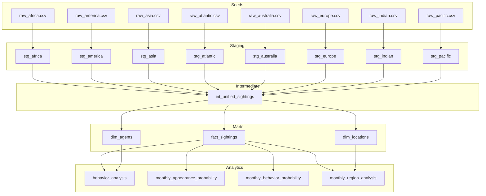
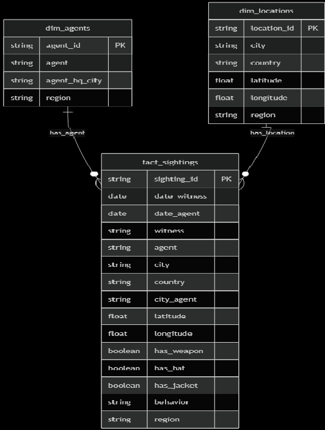
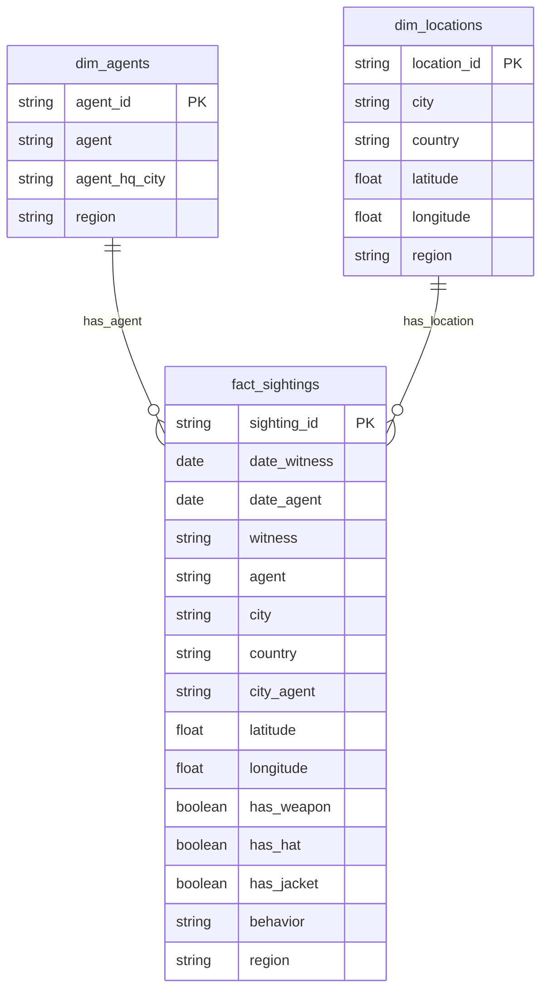
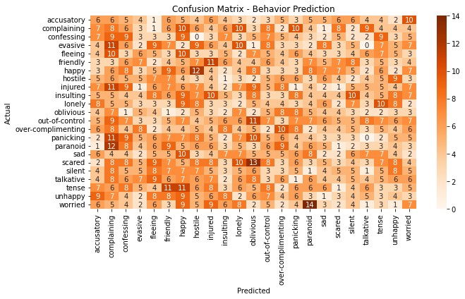

# Carmen Sandiego Sightings DBT & ML Project

## Table of Contents

- [Project Overview](#project-overview)
- [Structure](#structure)
- [Repository Files](#repository-files)
- [Installation & Setup Guide](#installation--setup-guide)
- [Pipeline Flow, Decisions, & Schema Design](#pipeline-flow-decisions--schema-design)
- [Entity Relationship Diagram](#entity-relationship-diagram)
- [Analytics](#analytics)
- [Machine Learning Methods & Insights](#machine-learning-methods--insights)

## Project Overview


This dbt project transforms Carmen Sandiego sighting data from eight different regional sources into a unified analytical schema. The project follows an ELT (Extract, Load, Transform) pattern using dbt with PostgreSQL as the data warehouse. As a bonus, this project also features a machine learning step to showcase additional insights.

---

### Structure



### Repository Files

```
cascade_carmen_dbt_project/
├── README.md                  # Project documentation
├── dbt_project.yml            # dbt project config
├── extract.py                 # Extracts Excel to CSV seeds
├── data/
│   └── raw/                   # Original Excel data
├── seeds/                     # Eight regional raw CSVs (input to dbt)
├── models/
│   ├── staging/               # Standardizes each region (stg_*.sql)
│   ├── intermediate/          # Combines all regions (int_unified_sightings.sql)
│   ├── marts/                 # Core tables: fact & dimension tables, plus analytics
│   └── schema.yml             # Data tests (unique, not_null, etc.)
├── macros/                    # Reusable SQL logic (e.g., standardize_columns)
└── tests/                     # (Optional) Custom test SQL
```


### Installation & Setup Guide

1. Clone this repository and install dependencies:
    ```bash
    pip install -r requirements.txt
    ```
2. Run the extraction script to convert Excel data sheets into individual CSV files:
    ```bash
    python extract.py
    ```
3. Set up your PostgreSQL database and local credentials.
4. Initialize the dbt project (if not already done) and configure your `~/.dbt/profiles.yml`.
5. Ensure `dbt_project.yml` is properly configured.
6. Run the following dbt commands to execute the pipeline:
    ```bash
    dbt debug      # Test connection with the database
    dbt deps       # Install dbt packages if needed
    dbt seed       # Load seed data into PostgreSQL as raw tables
    dbt run        # Build all models
    dbt test       # Run data quality tests
    dbt compile    # Generate executable SQL from source, model, test, and analysis files
    dbt docs generate && dbt docs serve  # Generate and view dbt docs at http://localhost:8080
    ```
7. For analytics, connect to your PostgreSQL database using the psql shell (or run `psql -U postgres -d your_database` from any terminal) to run SQL queries:
    ```bash
    # Example:
    psql -U <username> -d <database_name>   # Connect to your database
    \dn                                    # Check schemas
    \dt carmen_marts.*                     # Check tables in marts schema
    SELECT * FROM carmen_marts.fact_sightings LIMIT 5;  # Sample data
    ```
8. To run the bonus **machine learning** step for additional data insights:
    ```bash
    python ml_analysis.py
    ```


### Pipeline Flow, Decisions, & Schema Design

- **Staging / Intermediate / Marts Layers:**
  - **Seeds:** Raw data extracted from Excel and ingested into the PostgreSQL database.
  - **Staging:** Each region’s raw data is standardized into a common schema using macros (see view models for column mapping).
  - **Intermediate:** All standardized data is joined into a single unified view, with boolean standardization across regions.
  - **Marts/Core:** Fact and dimension tables are built from the unified data, with surrogate keys and data cleaning.
- **Star Schema:** The fact table is in the third normal form, while dimension tables are denormalized for query performance and ease of analysis. This reduces the need for complex joins and accelerates dashboarding and machine learning workflows.
    - Surrogate keys are used for uniqueness and referential integrity.
- **Analytics:** Specialized models answer business questions and provide metrics for reporting and machine learning.
- **Testing & Validation:** dbt tests and `schema.yml` files are used to validate data integrity (e.g., uniqueness, null checks, referential integrity). Examples:
    - Column type assertions for dates and coordinates
    - Null checks for critical fields

### Entity Relationship Diagram


<!--  -->



---


<!-- ## **Star Schema Structure**
---
### **Normalization & Standardization**

- **Standardization:**
  - All raw data is mapped to a consistent schema in the staging layer using the `standardize_columns` macro. This ensures that, regardless of the source, columns like `agent`, `city`, `has_weapon`, etc., have the same names and types.
- **Normalization:**
  - The star schema is a blend of normalized and denormalized design:
    - **Dimension tables** are normalized to the third normal form to reduce redundancy and maintain data quality. Each agent/location appears only once, with a unique surrogate key ensuring referential integrity.
    - **Fact table** is denormalized to enable fast, simple queries for analytics and reporting purposes. It stores foreign keys to dimensions and all event attributes for fast querying, as all relevant data is one join away. -->


# Analytics

---
**Four Key Questions:**
A. **Regional Monthly Activity:** Which region has the most sightings per month?
B. **Appearance Probability:** Likelihood of a specific clothing combination (armed + jacket - hat)
C. **Top Behaviors:** Top 3 most frequently observed behaviors
D. **Behavior Probability:** Monthly probability of exhibiting top behaviors

### A. Monthly region analysis


The table below shows sightings by month (with 1 meaning January). It also shows how often Carmen Sandiego was seen. The graph highlights that she’s mostly spotted in Kolkata and New York.

| month_n | city_agent | record_count |
|---------|------------|--------------|
| 1       | Kolkata    | 98           |
| 2       | New York   | 86           |
| 3       | New York   | 89           |
| 4       | New York   | 91           |
| 5       | Kolkata    | 94           |
| 6       | Kolkata    | 83           |
| 7       | New York   | 94           |
| 8       | Kolkata    | 88           |
| 9       | New York   | 71           |
| 10      | New York   | 69           |
| 11      | New York   | 93           |
| 12      | Kolkata    | 94           |

### B. Appearance probability


The probability of Carmen being armed and wearing a jacket but not a hat is highest in June (4.74%) and lowest in November (2.43%). This appearance is rare overall, never exceeding 5% in any month. She is almost always seen with a jacket, and often with a hat, but being armed is less common.

| month_n | total_per_month | conditional_per_month | probability | armed_count | hat_count | jacket_count | armed_probability | hat_probability | jacket_probability |
|---------|-----------------|----------------------|-------------|-------------|-----------|--------------|-------------------|-----------------|--------------------|
| 1       | 1147            | 44                   | 0.0384      | 125         | 716       | 1074         | 0.1090            | 0.6242          | 0.9364             |
| 2       | 1045            | 35                   | 0.0335      | 122         | 675       | 969          | 0.1167            | 0.6459          | 0.9273             |
| 3       | 1147            | 53                   | 0.0462      | 135         | 723       | 1061         | 0.1177            | 0.6303          | 0.9250             |
| 4       | 1118            | 36                   | 0.0322      | 124         | 706       | 1032         | 0.1109            | 0.6315          | 0.9231             |
| 5       | 1178            | 41                   | 0.0348      | 117         | 740       | 1096         | 0.0993            | 0.6282          | 0.9304             |
| 6       | 1139            | 54                   | 0.0474      | 153         | 731       | 1041         | 0.1343            | 0.6418          | 0.9140             |
| 7       | 1147            | 44                   | 0.0384      | 122         | 710       | 1055         | 0.1064            | 0.6190          | 0.9198             |
| 8       | 1147            | 50                   | 0.0436      | 138         | 726       | 1055         | 0.1203            | 0.6330          | 0.9198             |
| 9       | 1110            | 48                   | 0.0432      | 134         | 697       | 1022         | 0.1207            | 0.6279          | 0.9207             |
| 10      | 1147            | 49                   | 0.0427      | 124         | 693       | 1047         | 0.1081            | 0.6042          | 0.9128             |
| 11      | 1110            | 27                   | 0.0243      | 117         | 692       | 1029         | 0.1054            | 0.6234          | 0.9270             |
| 12      | 1147            | 52                   | 0.0453      | 141         | 717       | 1078         | 0.1229            | 0.6251          | 0.9398             |

### C. Behavior analysis


Based on the results, the three most common behaviors observed for Carmen Sandiego are out-of-control, complaining, and happy. However, the lack of variability across all behaviors suggests that Carmen exhibits a diverse range of behaviors.

| behavior        | frequency | percentage | behavior_rank |
|-----------------|-----------|------------|---------------|
| out-of-control  | 637       | 4.69       | 1             |
| complaining     | 636       | 4.68       | 2             |
| happy           | 635       | 4.68       | 3             |


### D. Monthly behavior probability


For each month, the probability that Carmen exhibits one of her three most common behaviors ranges from about 12% to 15%. The highest probability occurs in May (15.28%), while the lowest is in October (12.12%). With only minor variation throughout the year, this once again suggests that her behavioral patterns are relatively consistent across all months.

| month_n | total_per_month | top_behavior_count | top_behavior_probability |
|---------|-----------------|-------------------|-------------------------|
| 1       | 1147            | 160               | 0.1395                  |
| 2       | 1045            | 144               | 0.1378                  |
| 3       | 1147            | 171               | 0.1491                  |
| 4       | 1118            | 154               | 0.1377                  |
| 5       | 1178            | 180               | 0.1528                  |
| 6       | 1139            | 157               | 0.1378                  |
| 7       | 1147            | 160               | 0.1395                  |
| 8       | 1147            | 158               | 0.1378                  |
| 9       | 1110            | 167               | 0.1505                  |
| 10      | 1147            | 139               | 0.1212                  |
| 11      | 1110            | 160               | 0.1441                  |
| 12      | 1147            | 158               | 0.1378                  |

---


# Machine Learning Methods & Insights

- Python scripts (`ml_analysis.py`, etc.) connect to the transformed database and run ML analyses.
- **Methods Used:**
  - Random Forest classifiers for predicting region and behavior
  - Label encoding for categorical variables
  - Feature importance analysis
  - Clustering and pattern detection via groupby statistics

### Predicting Carmen's Next Region

Region Prediction Accuracy: 0.996

Feature Importance for Region Prediction:

| Feature           | Importance |
|-------------------|------------|
| longitude         | 0.670443   |
| latitude          | 0.292266   |
| prev_latitude     | 0.009627   |
| prev_longitude    | 0.009470   |
| behavior_encoded  | 0.006431   |
| month             | 0.005052   |
| day_of_week       | 0.003887   |
| has_hat           | 0.001376   |
| has_weapon        | 0.000725   |
| has_jacket        | 0.000723   |


### Predicting Carmen's Behavior
Behavior Prediction Accuracy: 0.041




### Pattern Detection

| Season | Region    | Has Weapon | Has Hat | Has Jacket | Latitude | Longitude |
| ------ | --------- | ---------- | ------- | ---------- | -------- | --------- |
| Fall   | africa    | 0.110      | 0.649   | 0.922      | 9.291    | 15.175    |
|        | america   | 0.106      | 0.590   | 0.927      | 22.035   | -82.071   |
|        | asia      | 0.108      | 0.643   | 0.924      | 26.418   | 97.224    |
|        | atlantic  | 0.125      | 0.750   | 0.875      | 32.753   | -20.626   |
|        | australia | 0.171      | 0.537   | 0.976      | -33.221  | 145.415   |
|        | europe    | 0.117      | 0.613   | 0.907      | 48.856   | 13.598    |
|        | indian    | 0.053      | 0.789   | 0.947      | -20.175  | 46.916    |
|        | pacific   | 0.143      | 0.619   | 0.952      | -19.298  | 78.664    |
| Spring | africa    | 0.112      | 0.650   | 0.918      | 8.009    | 17.162    |
|        | america   | 0.099      | 0.621   | 0.919      | 21.645   | -81.702   |
|        | asia      | 0.124      | 0.634   | 0.938      | 25.550   | 95.808    |
|        | atlantic  | 0.091      | 0.636   | 0.818      | 35.931   | -23.834   |
|        | australia | 0.116      | 0.605   | 0.907      | -33.307  | 143.280   |
|        | europe    | 0.102      | 0.633   | 0.927      | 48.576   | 12.883    |
|        | indian    | 0.045      | 0.545   | 0.955      | -20.563  | 48.127    |
|        | pacific   | 0.278      | 0.556   | 0.889      | -12.638  | 76.561    |
| Summer | africa    | 0.136      | 0.588   | 0.920      | 10.645   | 15.853    |
|        | america   | 0.124      | 0.641   | 0.908      | 22.580   | -81.925   |
|        | asia      | 0.112      | 0.629   | 0.925      | 26.297   | 95.880    |
|        | atlantic  | 0.000      | 0.600   | 1.000      | 29.758   | -17.602   |
|        | australia | 0.229      | 0.714   | 0.914      | -32.979  | 144.465   |
|        | europe    | 0.117      | 0.632   | 0.918      | 48.513   | 13.388    |
|        | indian    | 0.083      | 0.833   | 1.000      | -20.785  | 46.499    |
|        | pacific   | 0.083      | 0.583   | 1.000      | -18.487  | 135.325   |
| Winter | africa    | 0.128      | 0.619   | 0.934      | 7.674    | 15.725    |
|        | america   | 0.116      | 0.640   | 0.940      | 22.232   | -81.219   |
|        | asia      | 0.113      | 0.619   | 0.935      | 26.116   | 94.727    |
|        | atlantic  | 0.250      | 1.000   | 0.750      | 32.753   | -20.626   |
|        | australia | 0.043      | 0.609   | 0.935      | -32.914  | 145.859   |
|        | europe    | 0.120      | 0.637   | 0.928      | 48.609   | 12.876    |
|        | indian    | 0.130      | 0.522   | 0.957      | -20.665  | 49.636    |
|        | pacific   | 0.000      | 0.800   | 1.000      | -7.052   | 56.722    |


| Behavior           | Has Weapon | Has Hat | Has Jacket | # of Reports |
| ------------------ | ---------- | ------- | ---------- | ------------ |
| out-of-control     | 0.111      | 0.597   | 0.920      | 637          |
| complaining        | 0.108      | 0.634   | 0.936      | 636          |
| happy              | 0.088      | 0.638   | 0.893      | 635          |
| tense              | 0.119      | 0.627   | 0.923      | 614          |
| insulting          | 0.113      | 0.639   | 0.918      | 613          |
| panicking          | 0.110      | 0.640   | 0.942      | 608          |
| confessing         | 0.114      | 0.616   | 0.931      | 597          |
| unhappy            | 0.106      | 0.636   | 0.926      | 596          |
| fleeing            | 0.131      | 0.638   | 0.921      | 596          |
| over-complimenting | 0.121      | 0.599   | 0.928      | 596          |

Here's your markdown-ready version of the analysis, properly formatted for a GitHub README:

---

## 🔍 ANALYSIS 2: Predicting Carmen's Behavior

**Behavior Prediction Accuracy:** `0.041`


---

## 📊 ANALYSIS 3: Pattern Detection

### Seasonal Patterns by Region

| Season | Region    | Has Weapon | Has Hat | Has Jacket | Latitude | Longitude |
| ------ | --------- | ---------- | ------- | ---------- | -------- | --------- |
| Fall   | africa    | 0.110      | 0.649   | 0.922      | 9.291    | 15.175    |
|        | america   | 0.106      | 0.590   | 0.927      | 22.035   | -82.071   |
|        | asia      | 0.108      | 0.643   | 0.924      | 26.418   | 97.224    |
|        | atlantic  | 0.125      | 0.750   | 0.875      | 32.753   | -20.626   |
|        | australia | 0.171      | 0.537   | 0.976      | -33.221  | 145.415   |
|        | europe    | 0.117      | 0.613   | 0.907      | 48.856   | 13.598    |
|        | indian    | 0.053      | 0.789   | 0.947      | -20.175  | 46.916    |
|        | pacific   | 0.143      | 0.619   | 0.952      | -19.298  | 78.664    |
| Spring | africa    | 0.112      | 0.650   | 0.918      | 8.009    | 17.162    |
|        | america   | 0.099      | 0.621   | 0.919      | 21.645   | -81.702   |
|        | asia      | 0.124      | 0.634   | 0.938      | 25.550   | 95.808    |
|        | atlantic  | 0.091      | 0.636   | 0.818      | 35.931   | -23.834   |
|        | australia | 0.116      | 0.605   | 0.907      | -33.307  | 143.280   |
|        | europe    | 0.102      | 0.633   | 0.927      | 48.576   | 12.883    |
|        | indian    | 0.045      | 0.545   | 0.955      | -20.563  | 48.127    |
|        | pacific   | 0.278      | 0.556   | 0.889      | -12.638  | 76.561    |
| Summer | africa    | 0.136      | 0.588   | 0.920      | 10.645   | 15.853    |
|        | america   | 0.124      | 0.641   | 0.908      | 22.580   | -81.925   |
|        | asia      | 0.112      | 0.629   | 0.925      | 26.297   | 95.880    |
|        | atlantic  | 0.000      | 0.600   | 1.000      | 29.758   | -17.602   |
|        | australia | 0.229      | 0.714   | 0.914      | -32.979  | 144.465   |
|        | europe    | 0.117      | 0.632   | 0.918      | 48.513   | 13.388    |
|        | indian    | 0.083      | 0.833   | 1.000      | -20.785  | 46.499    |
|        | pacific   | 0.083      | 0.583   | 1.000      | -18.487  | 135.325   |
| Winter | africa    | 0.128      | 0.619   | 0.934      | 7.674    | 15.725    |
|        | america   | 0.116      | 0.640   | 0.940      | 22.232   | -81.219   |
|        | asia      | 0.113      | 0.619   | 0.935      | 26.116   | 94.727    |
|        | atlantic  | 0.250      | 1.000   | 0.750      | 32.753   | -20.626   |
|        | australia | 0.043      | 0.609   | 0.935      | -32.914  | 145.859   |
|        | europe    | 0.120      | 0.637   | 0.928      | 48.609   | 12.876    |
|        | indian    | 0.130      | 0.522   | 0.957      | -20.665  | 49.636    |
|        | pacific   | 0.000      | 0.800   | 1.000      | -7.052   | 56.722    |

### Behavior Statistics

| Behavior           | Has Weapon | Has Hat | Has Jacket | # of Reports |
| ------------------ | ---------- | ------- | ---------- | ------------ |
| out-of-control     | 0.111      | 0.597   | 0.920      | 637          |
| complaining        | 0.108      | 0.634   | 0.936      | 636          |
| happy              | 0.088      | 0.638   | 0.893      | 635          |
| tense              | 0.119      | 0.627   | 0.923      | 614          |
| insulting          | 0.113      | 0.639   | 0.918      | 613          |
| panicking          | 0.110      | 0.640   | 0.942      | 608          |
| confessing         | 0.114      | 0.616   | 0.931      | 597          |
| unhappy            | 0.106      | 0.636   | 0.926      | 596          |
| fleeing            | 0.131      | 0.638   | 0.921      | 596          |
| over-complimenting | 0.121      | 0.599   | 0.928      | 596          |

### Predictive Insights

Predicted next region for average conditions: africa

High-risk profile (Armed + Jacket + No Hat) most common in:
america    166
europe     160
asia       147


---

